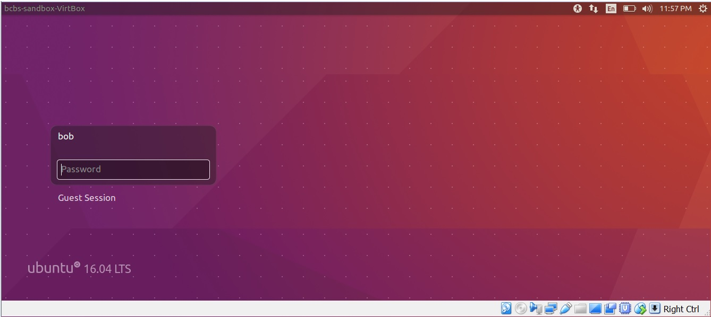
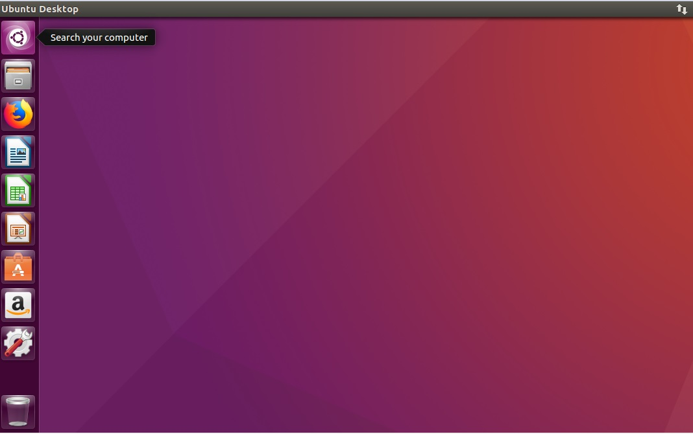
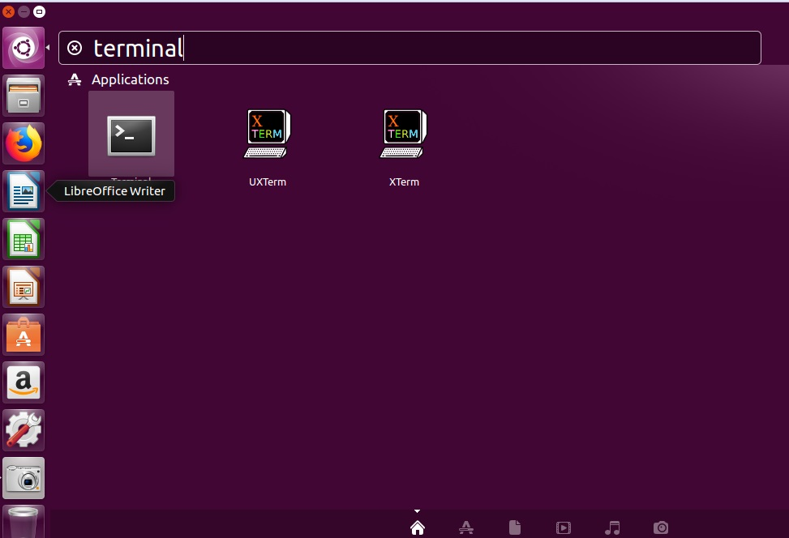
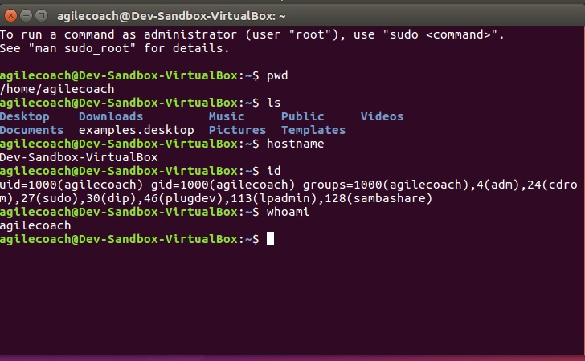

# Getting Started with Developer Sandbox
## Heading Level 2
### Heading Level 3

- list
- list
  - list indented

  1. Number 1
  2. Number 2

  [link to Google](https://www.google.com)
  

  -
https://code.tutsplus.com/tutorials/a-linux-developers-setup--cms-22138

The installation walkthrough below will refer to Ubuntu, but you are free to use any other distribution. Depending on which you go for, the installation and package management instructions change, so keep that in mind when using something like Fedora, CentOS, or Arch.

## Step by Step Tutorial

#### Login ####
Using your user name and password login to the Ubuntu Desktop.

#### Open terminal
Move mouse over search bard

Type in "terminal" and select one of the terminial applications.

#### Checks out System ####
Once you have the terminal running execute the following commands
> $ pwd    # where am i
>
> $ ls     # what i in current directory
>
> $ id     # who am I logged in as

Now is time to install some prerequistes

#### Install the following prerequisites ####
Verify you have the following commands installed
- wget
- unzip
- curl
- git
- java

For example to install git, check to see if **git is installed**. If not
> $git
>
> $ sudo apt install git
>
> $ git    # command should now be available

### JavaScript Developer Setup ###
Working with JavaScript is usually very easy to get started with, due to browsers being an active development asset. However, that's not the case in the server side. Node.js is available in most Linux distributions but the latest version is not always ready to be installed. For that purpose we'll install a Node version manager, install a version, and go from there.

The version manager that we'll use for this article is nvm, but you can also look up n as an alternative. If you go through the README you will need to paste the first instruction into a terminal:

1
$ curl https://raw.githubusercontent.com/creationix/nvm/v0.15.0/install.sh | bash
If you don't have curl installed, the command will complain. Type sudo apt-get install curl in your terminal, and then run the previous command again.

The command retrieves a script from GitHub that is run directly on your system. You will have nvm installed in your home folder so you won't have any trouble with permissions, unlike when you install it from the Ubuntu packages. You can check if nvm is correctly working by typing nvm in the terminal. If an error occurs, probably you'll need to edit your shell configuration file. Edit the .bashrc file as we did for chruby, and add the following code at the end of the file:
